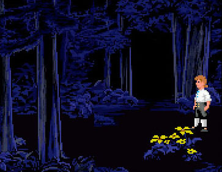

---
Alias:
- digital garden
created: 2020-12-02 21:53
tags:
- moc
title: Digital Garden
updated: 2021-03-14
---
   
Something inbetween a blog, personal notes, twitter and… Actually, you know what? It's exactly what the internet – personal websites – used to be in the 90s.   
   
## What Digital Gardens Are to Me   
   
   
For me it is also a way of revisiting memories. As they bubble up, I write them down, which makes space for new (err… older) bubbles to float to the surface, where I again catch those, and encase them in the beautiful, glowing, warm amber of… cold clean digital text…   
   
It's a cozy and comforting way to rummage through ones damp, dark, sharply edged and metallic memory conduits. Usually there's rust and leaking fluids as well. Not the clean Jeffrey Tubes of [tng](/not_created.md).   
   
A core tenet of digital gardening is to forget perfectionism. Your flowers will get pests, your fruit trees will be crooked, snails will eat your flowers, deer will feast upon your berries. A perfectly manicured garden is not what a garden is for. A perfectly manicured garden is obsesion – a garden is for play, relaxing, having shower thoughts.   
   
### The Best Digital Garden Retains a Sense of Wilderness   
A good digital garden graph should be well-connected, but not too much. There should be dead ends, alleyways from which you can only escape by retracing your steps. You *should* get lost. You should *have* to retrace your steps. [Digital gardens forego most traditional navigational elements.](./The%20essence%20of%20a%20digital%20garden%20is%20a%20personal%20website%20that%20foregoes%20navigational%20elements.md)   
   
Illustrated by way of [adventure games](/not_created.md)    
   
   
   
   
As my wife and I decided after buying a house with a well-kept garden: It is for children to play in. For neighbours and friends to eat barbequeue and drink white wine in. And occasionally to enjoy the breeze while pissing on an apple tree.   
   
>I’ve collected a list of websites which reminded me having a wealth of content is more important than the form it takes, and I decided to stop obsessing over ingenuity in favour of doing something that will exist sooner rather than later   
>- [https://winnielim.org/library/collections/personal-websites-with-a-wealth-of-information/](https://winnielim.org/library/collections/personal-websites-with-a-wealth-of-information/) - personal websites with a wealth of information - is a synonym for digital garden   
   
   
   
### Flaneuring the Garden   
I think flaneuring describes how I explore digital gardens best.   
   
It is also how digital gardens are intended to be… processed, to use a far less organic word. At least it seems to be the trend.   
   
Is this too urban and technical terminology? It's causing some cognitive dissonance to reconcile "digital" and "gardening". But I'm trying by [flaneuring the wilderness](./The%20best%20digital%20garden%20retains%20a%20sense%20of%20wilderness.md).   
   
   
   
   
   
   
   
---   
   
## Digital Gardens in the Wild   
   
There's heaps of references to the woman that draws, the guy with the manifesto, the guy with not a blog, and the guy that **everybody** links to with the horizontal web interface gimmick(\*)   
Here's some things I found below the surface:   
   
- [Why Bother?](https://salman.io/blog/why-bother/) by Salman – On why to bother, which I have wondered regarding my notes in [sw.obsidian](/not_created.md). Is it worth it?   
- [Mind Garden Benefits: 🌱🌲 🌱 Nurse Log Notes — a mind garden planted by c wess daniels](https://cwdaniels.github.io/index.html)   
	The benefits are myriad. Mine currently – after about 9 months (as per 2020-12) after having learned of the term digital garden – is that my mind constantly prowls the thoughts that surface throughout the day for connections to other thoughts and concepts I hold.   
   
- [Rough Notes Loosely Organized](/not_created.md)   
   
   
\*(I actually think it's a great idea, not a gimmick, but, you know, for dramatic effect…)   
   
>Everyone should create their own everything i know series   
>– raghuveer.net, [Knowledge Continuum](https://www.raghuveer.net/posts/everyone-should-create-their-own-everything-i-know-series)   
   
### Digital Gardens and Information Design   
There seems to be an overlap of digital gardeners and information systems design people. A lot of articles about how to design information interfaces, the future of the web, wistful articles about Project Xanadu and how we have fucked up and deviated from the original vision of hypertext.   
   
   
   
- [Azlen Elza on Twitter: "Exploring different methods of navigation for my public-facing @RoamResearch database Three different zoom levels? if you zoom out far enough you start to see the whole network of connections in the graph 1/4 [https://t.co/7d2XyfH3E8"](https://t.co/7d2XyfH3E8") / Twitter](https://twitter.com/azlenelza/status/1256696564145369093?s=20)   
   
   
   
## External   
   
[dd](https://kornysietsma.github.io/digital-garden-sample/-/meta/wiki/garden/)   
   
[Of Digital Streams, Campfires and Gardens](https://tomcritchlow.com/2018/10/10/of-gardens-and-wikis/)   
   
   
### Three sources   
[This post](https://joelhooks.com/digital-garden), by **Joel Hooks** in 2016, is considered the “Manifesto” by many digital gardener, even thought there are precursors like **The Garden and The Stream**, by Mike Caulfield in 2015 ([link](https://hapgood.us/2015/10/17/the-garden-and-the-stream-a-technopastoral/)), and even the 1998 **Hypertext Gardens** by Mark Bernstein ([link](http://www.eastgate.com/garden/Enter.html)).   
>source: [(Bi)Weekly Learning Journal 8 (9/11/2020)](https://retireinprogress.com/biweekly-learning-journal-8-9-11-2020/)   
   
## Lists of Gardens   
   
- There is my own list, of course: [Digital Gardens](/not_created.md)   
- Nikita has a fine wiki, and lists other fine wikis:   
[Wiki workflow - Everything I know](https://wiki.nikitavoloboev.xyz/other/wiki-workflow#similar-wikis-i-liked)   
   
- [GitHub - KasperZutterman/Second-Brain: A curated list of awesome Public Zettelkastens 🗄️ / Second Brains 🧠 / Digital Gardens 🌱](https://github.com/KasperZutterman/Second-Brain)   
   
## Reading material   
First, the aforementioned   
   
- manifesto man   
- the woman that draws   
	- [Maggie Appleton - A Brief History & Ethos of the Digital Garden](https://maggieappleton.com/garden-history)   
- Not a blog guy   
	- [Joel Hooks - 🌱 My blog is a digital garden, not a blog](https://joelhooks.com/digital-garden)   
- the horizontally scrolling man   
	- [https://notes.andymatuschak.org/About_these_notes](https://notes.andymatuschak.org/About_these_notes)   
   
   
- [Musings on open-source notes and digital gardens :: Up and to the Right — Jonathan Borichevskiy](https://jon.bo/posts/patch-notes-v4/)   
- [✨ Wellness Wisdom vol.21: idea sex & digital gardens](https://wellnesswisdom.substack.com/p/wellness-wisdom-vol21-idea-sex-and)   
-   [How the Blog Broke the Web](https://stackingthebricks.com/how-blogs-broke-the-web/) by Amy Hoy    
-   [Building a Digital Garden](https://tomcritchlow.com/2019/02/17/building-digital-garden/) by Tom Critchlow    
-   [The Garden and the Stream: A Technopastoral](https://hapgood.us/2015/10/17/the-garden-and-the-stream-a-technopastoral/) by Mike Caulfield   
-   [Meaningness](https://meaningness.com/) by David Chapman   
-   [Mind Garden](https://nesslabs.com/mind-garden) by Ness Labs   
-   [Digital Garden](https://www.mentalnodes.com/a-gardening-guide-for-your-mind) by Mental Node   
-   [Open Transclude for Networked Writing](https://subpixel.space/entries/open-transclude/) by Toby Shorin   
-   [Designing a self-directed learning network](https://winnielim.org/experiments/learning/designing-a-self-directed-learning-network-work-in-progress-v0-1/) by Winne Lim   
-   [Strategic Digital Gardening](https://docs.google.com/presentation/d/1eK9yJdkwxwV_HcdPh4xNxNl4o0knIAIm8otZ3AibJZU/edit#slide=id.p) by Willa   
       
   
   
---   
   
## Garden related links   
   
[✨Wellness Wisdom vol.21: idea sex & digital gardens - Wellness Wisdom](https://wellnesswisdom.substack.com/p/wellness-wisdom-vol21-idea-sex-and)