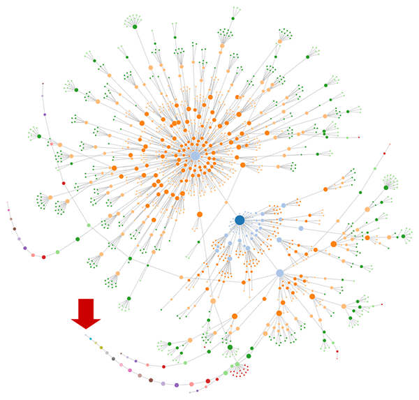

   
### The Best Digital Garden Retains a Sense of Wilderness   
A good digital garden graph should be well-connected, but not too much. There should be dead ends, alleyways from which you can only escape by retracing your steps. You *should* get lost. You should *have* to retrace your steps. [Digital gardens forego most traditional navigational elements.](./The%20essence%20of%20a%20digital%20garden%20is%20a%20personal%20website%20that%20foregoes%20navigational%20elements.md)   
   
Illustrated by way of [adventure games](/not_created.md)    
   
   
##   
and [technical SEO analysis](/not_created.md):   
   
*Image from [portent.com](https://www.portent.com/blog/seo/seo-force-directed-diagrams.htm) article about [visually gauging the structure of a site by way of a force-directed diagram](/not_created.md)*   
   
   
---   
See also:: [The essence of a digital garden is a personal website that foregoes navigational elements](./The%20essence%20of%20a%20digital%20garden%20is%20a%20personal%20website%20that%20foregoes%20navigational%20elements.md)   
topic:: [Digital Garden](./Digital%20Garden.md)