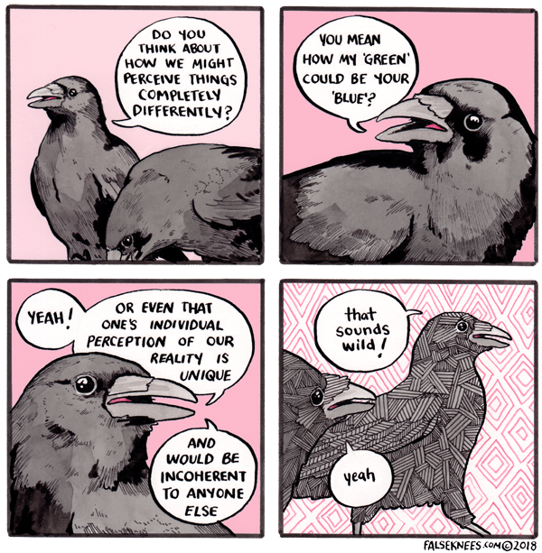

---
tags:
- consciousness
title: Human Consciousness
type: placeholder
---
   
   
>[!info]   
>This is a placeholder note. It has little to no content, and is here primarily to connect other notes.
   
   
   
By "human consciousness" I mean not how consciousness arises, what the nature of it is, but the limits of human perception and thought.   
   
For example:   
[t.humans are interesting because you can just barely understand them](./t.humans%20are%20interesting%20because%20you%20can%20just%20barely%20understand%20them.md)   
   
[https://falseknees.com/342.html](https://falseknees.com/342.html)   
   
   
   
---   
topic:: [Consciousness](/not_created.md)